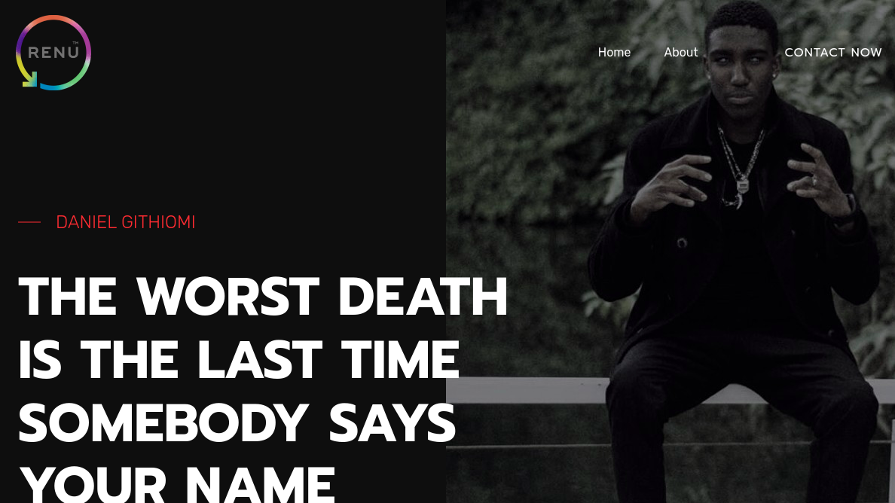

# DANIEL GITHIOMI'S PORTFOLIO

This is a web application that was created to display all that which I have been able to do in the Software Development World

Created by; * Daniel Githiomi *

## Screenshots

  

## Description

Through my time in school, I have learnt quite a number of things. Among them, programing languages such as:
   * HTML
   * CSS
   * Javascript
   * Java
   * Python
   * Angular
   * React Js, among others.
   
This website will direct you to these projects and give you the chance to slightly familiarize yourself with me.    

## Setup/Installation Requirements

Needs no installation

## Compatibility

  Compatible with all browsers.
   * Updates are made as soon I have another accomplishment. 

## Technologies Used
It is made completely using the Visual Studio-Insiders IDE and modified until the output is as you see it.

I also incorporated the following languages:
* HTML 5
* CSS, Bootstrap
* Javascript
* JQuery
* PhP

## Known Bugs
No bugs to report at the moment! the system works efficiently at 100% guaranteed. Feel free to search the output on googl to ensure that it coincides exactly.

## Link to live page
[Click-Here](https://githiomi.github.io/GAccess)

## Setup Instructions

However, not necessary, you can get this website locally through the following steps:

* git clone [This](https://githiomi.github.io/GAccess) into your terminal.  
* Open the folder in your favourite editor, for example vscode ,is code . and for atom, atom . 
* Open the index.html in your browser.
* Enjoy my portfolio and don't forget to leave a remark at the end of your experience.

## Support and contact details
Contact me through any of the following:
* Slack: danielgithiomi
* Email: danielgithiomi@gmail.com

### License
Click the following to access the license page: [Click-Here] (https://github.com/githiomi/license/blob/master/LICENSE)

Copyright (c) {2020} Dhosio Co.